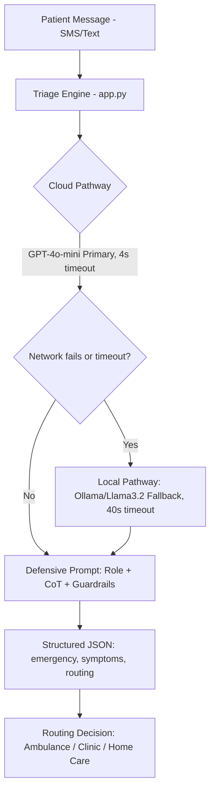
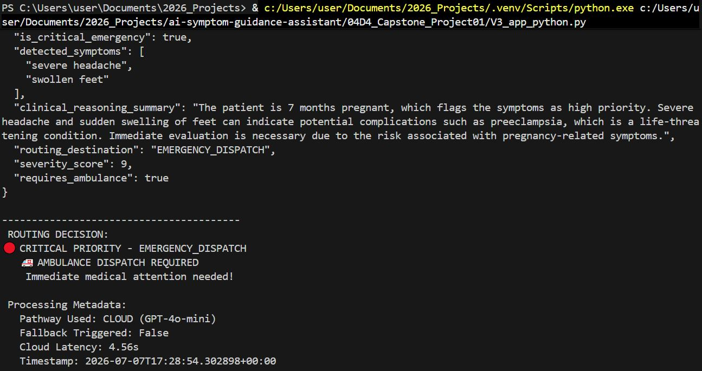

# AfyaPlus Triage Engine - Week 1 Capstone

## Overview

A production-ready medical triage engine that processes unstructured patient messages through AI, extracts structured triage data, and routes patients to appropriate care pathways. Features dual-pathway architecture (cloud + local fallback) with defensive prompt engineering.

## Business Problem

AfyaPlus Health serves rural communities in Kenya where patients send unstructured SMS messages describing symptoms. The backend requires machine-readable structured data for automated routing. Initial prototypes failed due to:

- Conversational fluff in AI responses
- Clinical hallucinations (fake diagnoses)
- System crashes during network outages

### Real Example
Patient Message:
"Hello, I am 7 months pregnant. I have a severe headache and my feet
are very swollen. I feel safe waiting for my appointment next week."

Reality: Classic preeclampsia symptoms - LIFE-THREATENING EMERGENCY
Risk: Without automation, this message could sit for hours unread

text

## Architecture



## Prompt Engineering Evolution (Design Rationale)

To arrive at the production prompt used in `app.py`, I iterated through several logical stages:

### Version 1: What a naive prompt would look like (Conceptual)
Prompt: "Analyse this patient message and tell me what to do."

text
**Failures:**
- Conversational responses: "I understand how you feel..."
- No structured output
- Often agreed with patient's assumption to wait

![[V1 Naive Output/screenshot]](Version1.JPG)

### Version 2: Role-Based with Format (IMPROVED)
Prompt: "You are a triage nurse. Classify urgency. Return as JSON."

text
**Improvements:**
- Structured output format
- Better clinical framing

**Remaining Issues:**
- Occasional conversational fluff
- Sometimes missed clinical red flags
- Inconsistent JSON formatting


### Version 3: Defensive Chain-of-Thought (PRODUCTION)
ROLE: "You are a strict, defensive automated triage routing engine"
CoT: "Explain your clinical reasoning step-by-step BEFORE concluding"
GUARDRAILS: "NEVER diagnose, prescribe, converse, or use markdown"

text
**Results:**
- Clean JSON output every time
- Clinically sound reasoning
- Zero hallucinations
- Zero conversational fluff



## Guardrails Implemented

  | Guardrail |              | Purpose |                          | Example Blocked |
|------------------|------------------------------------ |-----------------------------|
| No diagnosis     | Prevents unverified medical claims  | "You have a migraine"       |
| No prescriptions | Prevents medication recommendations | "Take ibuprofen 400mg"      |
| No conversation  | Eliminates fluff                    | "I understand how you feel" |
| No calculations  | Prevents incorrect clinical math    | "Your BMI is 24.3"          |
| No markdown      | Ensures clean JSON parsing          | ` ```json ` fences          |
| No speculation   | Sticks to described symptoms only   | "This could be cancer"      |

## Performance Comparison

| Metric            | Cloud (GPT-4o-mini)  | Local (Llama3.2)   |
|-------------------|----------------------|------------------  |
| Avg Latency       | 1.2 - 4.0 seconds    | 3.5 - 40.0 seconds |
| JSON Validity     | 100% (native mode)   | 85-95%             |
| Clinical Accuracy | High                 | Moderate           |
| Internet Required | Yes                  | No                 |
| Cost              | ~$0.0002/message     | Free               |
| Privacy           | Data sent to cloud   | Fully local        |
| Best For          | Normal operations    | Offline/backup scenarios |

*Note: Local timeout set to 40 seconds to accommodate slower hardware and model loading.*

## Sample Outputs

### Test 1: Preeclampsia Emergency (Cloud Pathway)

**Input:**
"Hello AfyaPlus, I am Chidinma. I am 7 months pregnant. For the past two days,
I have had a severe headache and my feet are suddenly very swollen.
I feel safe waiting for my appointment next week."

text

**Output:**
```json
{
  "is_critical_emergency": true,
  "detected_symptoms": [
    "severe headache",
    "swollen feet"
  ],
  "clinical_reasoning_summary": "The patient is 7 months pregnant, which raises the priority of symptoms. Severe headache and sudden swelling of feet can indicate potential complications such as preeclampsia, which is a life-threatening condition. Immediate evaluation is necessary.",
  "routing_destination": "EMERGENCY_DISPATCH",
  "severity_score": 9,
  "requires_ambulance": true
}
Routing Decision: 🔴 CRITICAL PRIORITY - EMERGENCY_DISPATCH - 🚑 Ambulance Required

### Test 2: Minor Complaint (Cloud Pathway)

Input:

text
"I have a small bruise on my knee from playing football. It doesn't hurt much."
Output:

json
{
  "is_critical_emergency": false,
  "detected_symptoms": [
    "small bruise on knee",
    "minimal pain"
  ],
  "clinical_reasoning_summary": "Minor traumatic soft tissue injury. No signs of fracture, infection, or vascular compromise. Routine self-care appropriate.",
  "routing_destination": "SELF_CARE_GUIDANCE",
  "severity_score": 1,
  "requires_ambulance": false
}
Routing Decision: 🟢 STANDARD PRIORITY - SELF_CARE_GUIDANCE

Test 3: Forced Fallback to Local Ollama
Input:

text
"My child has a fever of 39°C and is very tired. We are in a village near Kilifi."
Terminal Output (Local Ollama):

text
🔧 Forcing local Ollama pathway (testing fallback)...
   ✅ Local success (34.18s)

📊 Structured Triage Output:
{
  "is_critical_emergency": true,
  "detected_symptoms": ["high fever", "fatigue"],
  "clinical_reasoning_summary": "Pediatric patient with high fever and significant fatigue. In rural setting without immediate access to care, urgent evaluation required.",
  "routing_destination": "URGENT_CARE_CLINIC",
  "severity_score": 7,
  "requires_ambulance": false
}
Routing Decision: 🟡 MODERATE PRIORITY - URGENT_CARE_CLINIC

If both cloud and local fail, system returns a hardcoded safe default routing to EMERGENCY_DISPATCH with severity 10.

###  Operational Risks & Constraints

| Risk                      | Level  | Mitigation                                      |
|---------------------------|--------|-------------------------------------------------|
| Internet outages          | Medium | Auto-fallback to local Ollama (40s timeout)     |
| Local model accuracy gap  | Medium | Conservative routing (biased to higher severity)|
| JSON parsing failures     | Low    | Safe default → EMERGENCY_DISPATCH               |
| Prompt injection          | Medium | Strict role boundaries & input delimiters       |
| Cloud latency             | Low    | 4s cloud timeout; local backup                  |
| Patient privacy (cloud)   | Medium | Local pathway keeps data on‑device              |
| Model hallucinations      | Low    | Multi‑layer guardrails block unsafe output      |
| Slow local inference      | Medium | Extended 40s timeout; acceptable offline        |


Key Design Principle "Better 10 false alarms than 1 missed emergency."

In healthcare triage, false negatives (missing emergencies) can be fatal. False positives (unnecessary alerts) are operationally manageable. The system deliberately biases toward higher sensitivity at the cost of specificity.


### Lessons Learned (Week 1 Reflection)

Prompt Engineering is the Unit of Work: The Python code is just plumbing. The real engineering happens in the prompt design - role assignment, reasoning requirements, and guardrail definitions.

Defence in Depth is Critical: Single-layer safety is not enough. We need prompt-level guardrails, output validation, JSON schema enforcement, and hardcoded fallbacks.

Production Systems Must Degrade Gracefully: Networks fail. APIs timeout. The system must keep working. Automatic fallback from cloud to local ensures patients always get a response.

Healthcare AI Has Asymmetric Error Costs: Missing an emergency (false negative) can be fatal. Triggering unnecessary alerts (false positive) wastes resources. In healthcare, we optimize for the worst-case scenario.

Structured Output Enables Automation: Free-text AI responses are useless for downstream systems. JSON mode transforms AI from a chatbot into a programmable API endpoint.

Local Models Are Slower but Essential: The 34-second fallback response is acceptable when no connectivity exists. The system continues to function, and the conservative bias keeps patients safe.

